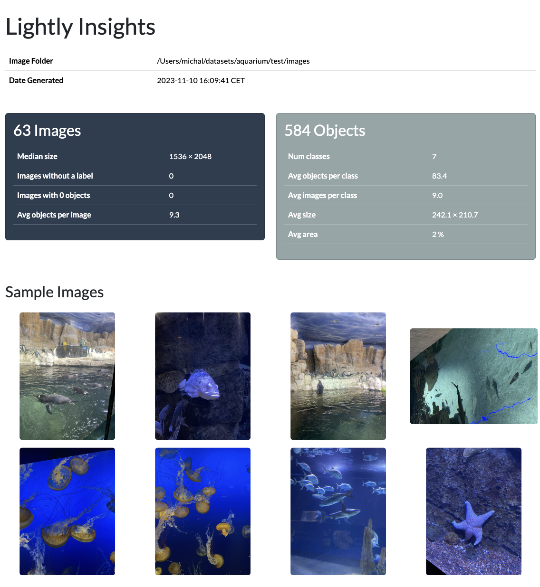
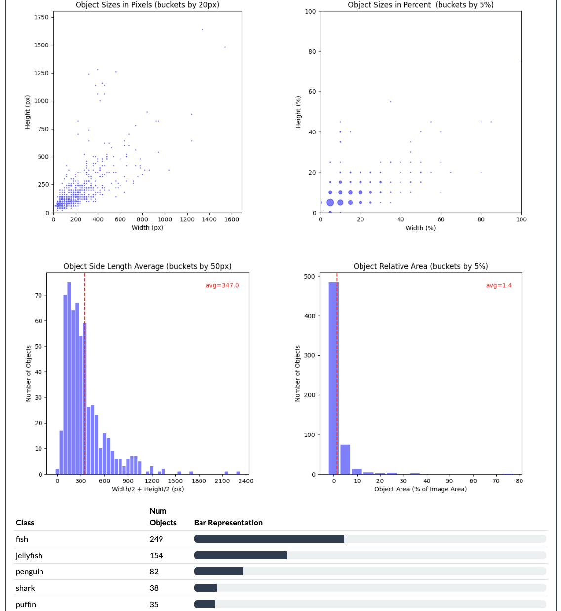
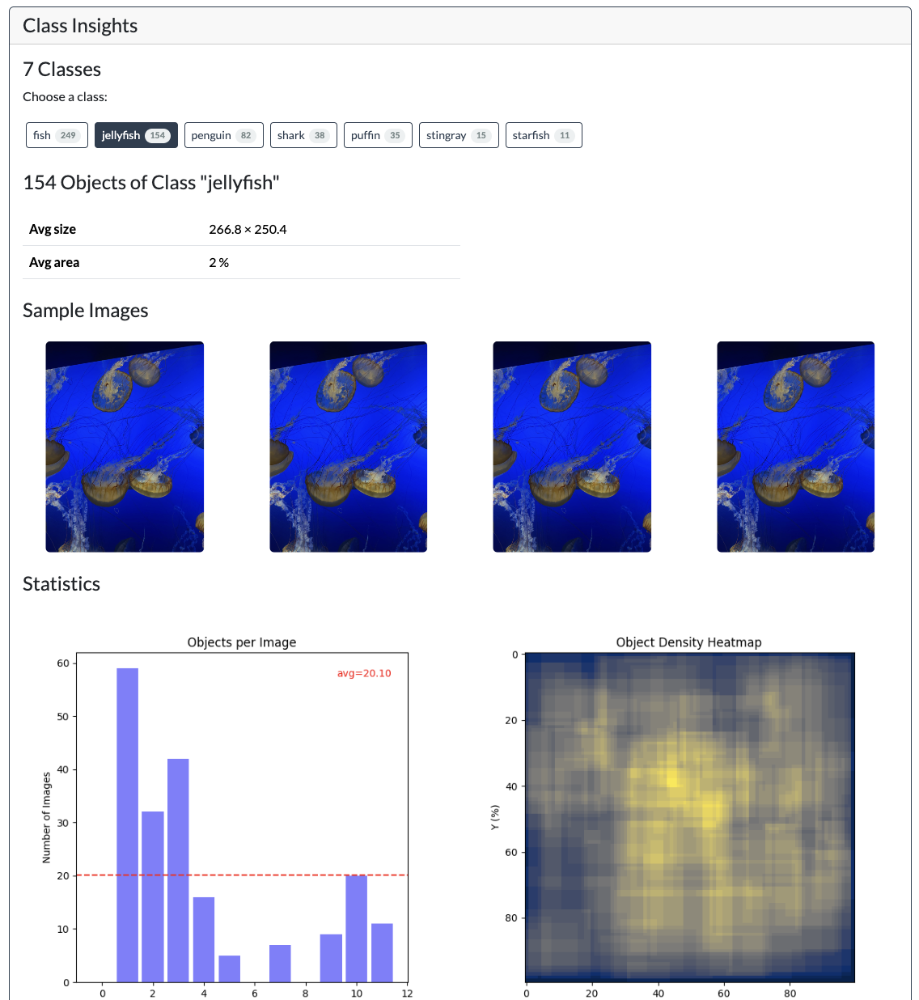

# Lightly Insights


[](https://pypi.org/project/lightly-insights/)
[](https://github.com/psf/black)

Get quick insights about your ML dataset.

Lightly Insights visualises basic statistics of an image dataset. You provide a folder with images and object
detection labels, and it generates a static HTML webpage with metrics and plots.

#### News

- March 23, 2026 - Check out [LightlyStudio](https://github.com/lightly-ai/lightly-studio), our latest tool to visualize, curate and manage a dataset with annotations.

#### Features

- **Check / finding framework** — 23 bundled checks across pipeline integrity, annotation quality, balance, and autolabel diagnostics (see [`docs/checks.md`](docs/checks.md)).
- **Works for boxes, polygons, and masks** — every geometry exposes the same API so checks run across types.
- **Autolabel aware** — `confidence` and `source` on each annotation enable over-confident-tiny detection, per-class bias scoring, multi-source disagreement, pretrained-model missing-label proposals.
- **Findings-first HTML report** with a priority review queue, per-finding drill-down thumbnails, source attribution, and cumulative review-burden curve.
- **Side-car exports** — `review_queue.csv` + `findings.json` + Markdown summary for CI / Slack / Studio ingestion.
- **Legacy report preserved** — original image-folder → HTML-with-many-plots flow still works.
- Supports all object detection label formats readable by [Labelformat](https://github.com/lightly-ai/labelformat): YOLO, COCO, KITTI, PascalVOC, Lightly, Labelbox.
- Typed
- MIT licensed

## Preview

See a [live example report](https://lightly-ai.github.io/lightly-insights-preview/) for a small dataset.

#### Screenshots

<p float="left">



</p>

## Installation

```
pip install lightly-insights
```

## Usage

Lightly Insights report is generated by a python script. This is necessary to support different label formats.

The example below uses [PascalVOC 2007](http://host.robots.ox.ac.uk/pascal/VOC/voc2007/index.html) dataset.
You can follow the example by downloading it (~450MB):

```
wget http://host.robots.ox.ac.uk/pascal/VOC/voc2007/VOCtrainval_06-Nov-2007.tar
tar -xvf VOCtrainval_06-Nov-2007.tar
```

To run Lightly Insights, we need to provide:

* Image folder. In our case that is `./VOCdevkit/VOC2007/JPEGImages`.
* Object detection labels. They are ingested as [Labelformat](https://github.com/lightly-ai/labelformat)
  ObjectDetectionInput class. For PascalVOC the constructor needs the folder with annotations
  `./VOCdevkit/VOC2007/Annotations` and the list of classes. For other format classes, please
  refer to [Labelformat formats](https://github.com/lightly-ai/labelformat/blob/main/src/labelformat/formats/__init__.py).

```py
from pathlib import Path
from labelformat.formats import PascalVOCObjectDetectionInput
from lightly_insights import analyze, present

# Analyze an image folder.
image_analysis = analyze.analyze_images(
    image_folder=Path("./VOCdevkit/VOC2007/JPEGImages")
)

# Analyze object detections.
label_input = PascalVOCObjectDetectionInput(
    input_folder=Path("./VOCdevkit/VOC2007/Annotations"),
    category_names=(
        "person,bird,cat,cow,dog,horse,sheep,aeroplane,bicycle,boat,bus,car,"
        + "motorbike,train,bottle,chair,diningtable,pottedplant,sofa,tvmonitor"
    )
)
od_analysis = analyze.analyze_object_detections(label_input=label_input)

# Create HTML report.
present.create_html_report(
    output_folder=Path("./html_report"),
    image_analysis=image_analysis,
    od_analysis=od_analysis,
)
```

To view the report, open `./html_report/index.html`.

## Findings-first API (new)

The check framework is the recommended entry point for programmatic use (LightlyStudio, CI, custom reporters).

```py
from pathlib import Path
from lightly_insights import checks  # triggers check registration
from lightly_insights.core import (
    Annotation, AnnotationKind, Box, Category, Dataset, Image,
    build_review_queue, export_review_queue_csv, run_all,
)
from lightly_insights.findings_present import create_findings_report

# 1. Build a Dataset. Annotations carry kind, geometry, and optionally
#    confidence + source (for autolabel workflows).
ds = Dataset(
    images=[Image(filename="img_0.png", width=1920, height=1080)],
    annotations=[
        Annotation(
            annotation_id=0,
            image_filename="img_0.png",
            class_id=0, class_name="car",
            kind=AnnotationKind.BOX,
            geometry=Box(xmin=120, ymin=200, xmax=380, ymax=420),
            confidence=0.92, source="yolo-v11",
        ),
    ],
    categories=[Category(id=0, name="car")],
)

# 2. Run all registered checks.
findings = run_all(ds)

# 3. Rank into a prioritized review queue.
queue = build_review_queue(findings, ds, max_items=200)

# 4a. Render the slim findings-first HTML report + side-car exports.
create_findings_report(Path("./report"), ds, findings, queue)

# 4b. Or just export the queue as a CSV for a labeling tool.
export_review_queue_csv(queue, Path("./review_queue.csv"))
```

### Bridge from an existing labelformat input

```py
from lightly_insights import analyze
from lightly_insights.core.adapter import build_dataset

image_analysis = analyze.analyze_images(image_folder=Path("./images"))
od_analysis = analyze.analyze_object_detections(label_input=label_input)
ds = build_dataset(
    image_analysis=image_analysis,
    od_analysis=od_analysis,
    label_input=label_input,
    source="human",  # or "yolo-v11", "sam", etc.
)
findings = run_all(ds)
```

### Pretrained-model proposals (missing-label detection)

Optional `[ml]` extra installs `ultralytics`. Use a frozen YOLO as a
proposer, merge its output into your dataset, and `missing_label_proposal`
flags its high-confidence predictions that don't overlap any real label.

```py
pip install 'lightly-insights[ml]'
```

```py
from lightly_insights.ml import propose_with_yolo

proposals = propose_with_yolo(
    image_paths=list(Path("./images").glob("*.png")),
    model="yolov8n.pt",
    confidence_threshold=0.25,
)
ds = Dataset(
    images=...,
    annotations=[*existing_annotations, *proposals],
    categories=...,
)
```

### Adding a custom check

```py
from lightly_insights.core import (
    AnnotationKind, Check, Dataset, Finding, Severity, register_check,
)

@register_check
class MyDomainCheck(Check):
    check_id = "my_domain_rule"
    title = "Domain-specific rule"
    category = "annotation"
    supported_kinds = frozenset({AnnotationKind.BOX})

    def run(self, dataset: Dataset) -> list[Finding]:
        findings = []
        for ann in dataset.annotations:
            if self._is_bad(ann):
                findings.append(Finding(
                    check_id=self.check_id,
                    severity=Severity.HIGH,
                    category=self.category,
                    title="...", detail="...", action="...",
                    affected_annotations=[ann.annotation_id],
                    affected_images=[ann.image_filename],
                ))
        return findings
```

Importing the module registers the check; `run_all` picks it up automatically.

## Documentation

- [`docs/architecture.md`](docs/architecture.md) — check/finding framework overview.
- [`docs/checks.md`](docs/checks.md) — reference for all 23 bundled checks.
- [`docs/metrics_ideas.md`](docs/metrics_ideas.md) — proposed additional metrics, ranked.
- [`CHANGELOG.md`](CHANGELOG.md) — release notes.

## Development

The library targets python 3.7 and higher. We use poetry to manage the development environment.

Here is an example development workflow:

```bash
# Create a virtual environment with development dependencies
poetry env use python3.7
poetry install

# Make changes
...

# Autoformat the code
poetry run make format

# Run tests
poetry run make all-checks
```

## Maintained By
[Lightly](https://www.lightly.ai) is a spin-off from ETH Zurich that helps companies 
build efficient active learning pipelines to select the most relevant data for their models.

You can find out more about the company and it's services by following the links below:

- [Homepage](https://www.lightly.ai)
- [Web-App](https://app.lightly.ai)
- [Lightly Solution Documentation (Lightly Worker & API)](https://docs.lightly.ai/)
