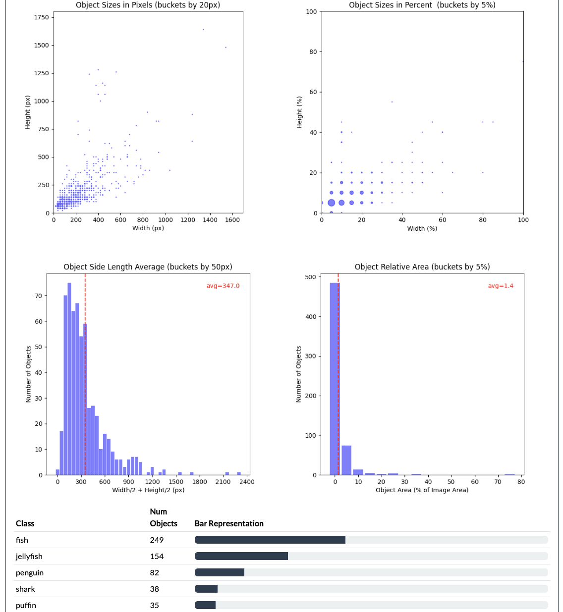

# Lightly Insights


[](https://pypi.org/project/lightly-insights/)
[](https://github.com/psf/black)

Get quick insights about your ML dataset.

Lightly Insights visualises basic statistics of an image dataset. You provide a folder with images and object
detection labels, and it generates a static HTML webpage with metrics and plots.

#### Features

- Supports all object detection label formats that can be read with [Labelformat](https://github.com/lightly-ai/labelformat) package. That includes YOLO, COCO, KITTI, PascalVOC, Lightly and Labelbox.
- Shows the image, object and class counts
- Analyzes how many images have no labels, and provides their filenames.
- Shows image samples
- Shows an analysis of image and object sizes
- Shows an analysis per class with object sizes, counts per image, location heatmap and other.
- Typed
- MIT licensed

## Preview

See a [live example report](https://lightly-ai.github.io/lightly-insights-preview/) for a small dataset.

#### Screenshots

<p float="left">



</p>

## Installation

```
pip install lightly-insights
```

## Usage

Lightly Insights report is generated by a python script. This is necessary to support different label formats.

The example below uses [PascalVOC 2007](http://host.robots.ox.ac.uk/pascal/VOC/voc2007/index.html) dataset.
You can follow the example by downloading it (~450MB):

```
wget http://host.robots.ox.ac.uk/pascal/VOC/voc2007/VOCtrainval_06-Nov-2007.tar
tar -xvf VOCtrainval_06-Nov-2007.tar
```

To run Lightly Insights, we need to provide:

* Image folder. In our case that is `./VOCdevkit/VOC2007/JPEGImages`.
* Object detection labels. They are ingested as [Labelformat](https://github.com/lightly-ai/labelformat)
  ObjectDetectionInput class. For PascalVOC the constructor needs the folder with annotations
  `./VOCdevkit/VOC2007/Annotations` and the list of classes. For other format classes, please
  refer to [Labelformat formats](https://github.com/lightly-ai/labelformat/blob/main/src/labelformat/formats/__init__.py).

```py
from pathlib import Path
from labelformat.formats import PascalVOCObjectDetectionInput
from lightly_insights import analyze, present

# Analyze an image folder.
image_analysis = analyze.analyze_images(
    image_folder=Path("./VOCdevkit/VOC2007/JPEGImages")
)

# Analyze object detections.
label_input = PascalVOCObjectDetectionInput(
    input_folder=Path("./VOCdevkit/VOC2007/Annotations"),
    category_names=(
        "person,bird,cat,cow,dog,horse,sheep,aeroplane,bicycle,boat,bus,car,"
        + "motorbike,train,bottle,chair,diningtable,pottedplant,sofa,tvmonitor"
    )
)
od_analysis = analyze.analyze_object_detections(label_input=label_input)

# Create HTML report.
present.create_html_report(
    output_folder=Path("./html_report"),
    image_analysis=image_analysis,
    od_analysis=od_analysis,
)
```

To view the report, open `./html_report/index.html`.

## Development

The library targets python 3.7 and higher. We use poetry to manage the development environment.

Here is an example development workflow:

```bash
# Create a virtual environment with development dependencies
poetry env use python3.7
poetry install

# Make changes
...

# Autoformat the code
poetry run make format

# Run tests
poetry run make all-checks
```

## Maintained By
[Lightly](https://www.lightly.ai) is a spin-off from ETH Zurich that helps companies 
build efficient active learning pipelines to select the most relevant data for their models.

You can find out more about the company and it's services by following the links below:

- [Homepage](https://www.lightly.ai)
- [Web-App](https://app.lightly.ai)
- [Lightly Solution Documentation (Lightly Worker & API)](https://docs.lightly.ai/)
